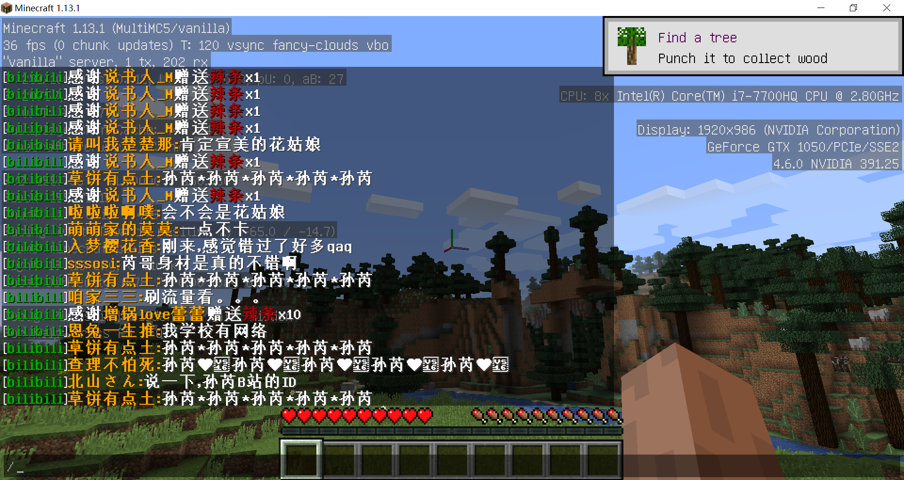
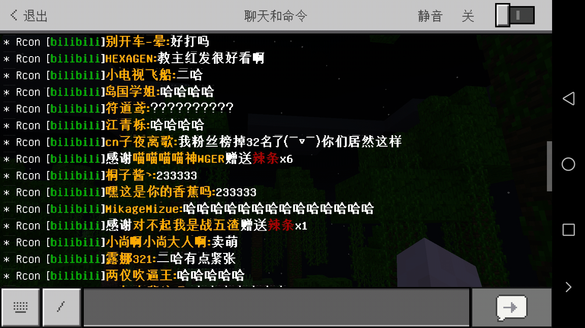

# MCRconDMK
Rcon版本弹幕姬...适配Minecraft Beta1.9→1.13.2服务端 与 pocketmine,nukkit等pe服务端

虽说支持远古的Beta1.9但是几乎无法正常显示中文，并且没有样式代码

感谢 <https://github.com/barneygale/MCRcon> 项目

受 <https://github.com/TartaricAcid/BakaDanmaku> 启发

## 效果

使用Minecraft1.13.1原版服务端

使用Nukkitx1.7.x兼容版
